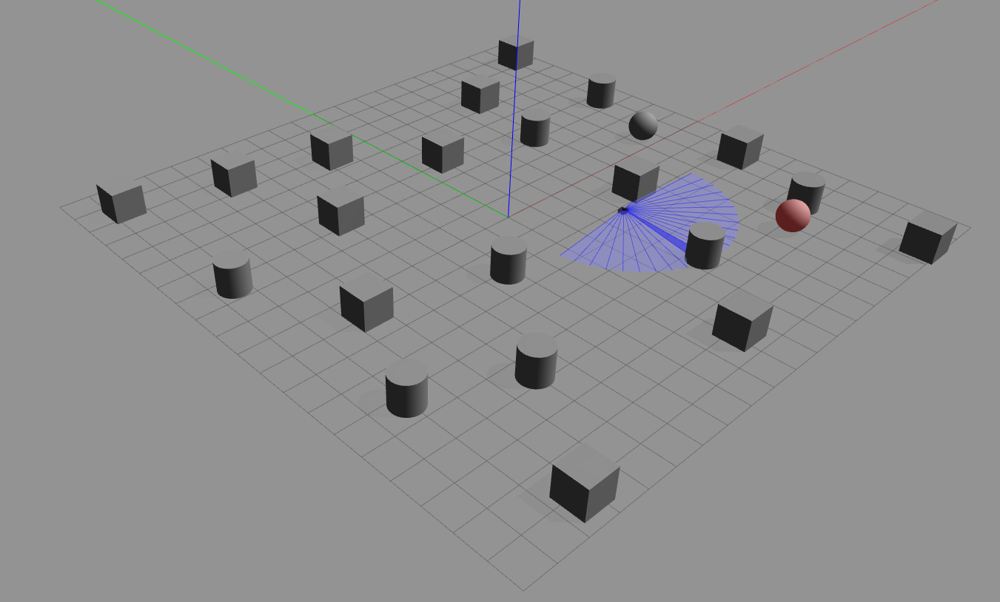
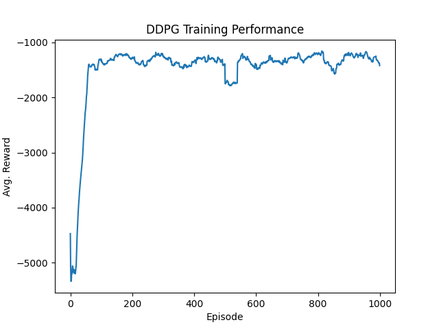
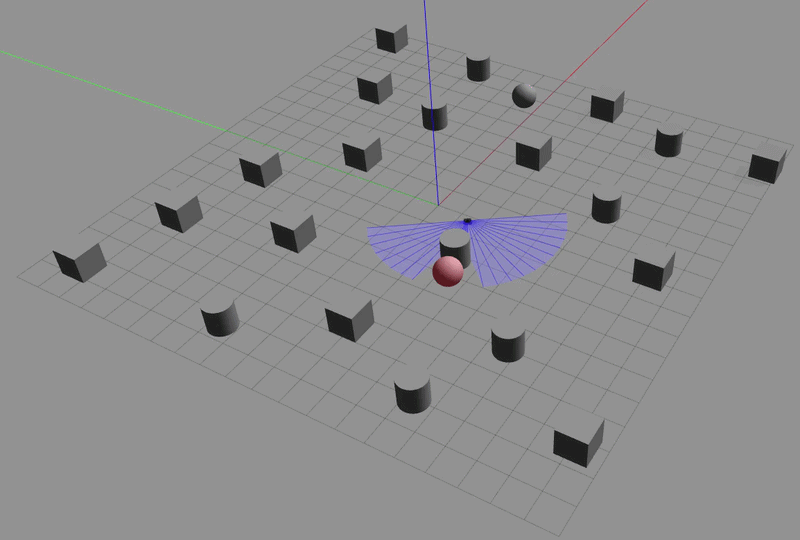

# Autonomous Navigation & Obstacle Avoidance for Mobile Robots via DRL 
**Status:** Active Research (Work in Progress)   


## Overview
This project implements the autonomous navigation behavior of a TurtleBot3 Waffle mobile robot under a cluttered simulated environment (turtlebot3_modified_maze.world). The system utilizes a **Deep Deterministic Policy Gradient (DDPG)** whose code is written based on the Keras Inverted Pendulum example (https://colab.research.google.com/github/keras-team/keras-io/blob/master/examples/rl/ipynb/ddpg_pendulum.ipynb) —to deliver continuous control over linear and angular velocities.

<p align="center">
  
  <br>
  <em>Figure 1: TurtleBot3 simulated in Gazebo with LiDAR mapping and dynamic target (pink ball)</em>
</p>

Using Python with ROS and Gazebo, the deep reinforcement learning framework is developed to:

- Learn obstacle avoidance behavior
- Reach dynamically placed goals 
- Avoid convergence to unsafe local optima (the *spinning trap*)
- Stabilize training through composite reward shaping

The DDPG architecture used in this project builds upon ideas from:

> Hu et al. (2020), *Voronoi-Based Multi-Robot Autonomous Exploration in Unknown Environments via Deep Reinforcement Learning*, IEEE Transactions on Vehicular Technology.

## Deep Reinforcement Learning Methodology
The navigation policy is trained using an **Actor–Critic DDPG framework**.

### State Space (28 Dimensions)
The observation vector consists of:
- 24 LiDAR rangefinder beams  
- 2 relative target coordinates (polar form)  
- 2 current velocity components  

This provides a compact and continuous representation of the robot’s environment.

### Continuous Action Space
The Actor network outputs:
* Linear velocity ($v$)
* Angular velocity ($\omega_z$)
Both values are bounded to ensure physically stable control.

### Network Architecture
The DDPG agent utilizes an Actor-Critic framework utilizing standard feed-forward Multi-Layer Perceptrons (MLPs). 

**1. Actor Network (Policy)**
The Actor maps the 28-dimensional state observation directly to a deterministic 2-dimensional continuous action.
* **Input:** 28-dim state vector
* **Hidden Layers:** Three fully-connected Dense layers (512 units each) utilizing `ReLU` activation.
* **Output:** Two parallel branches merged into a single vector:
  * Linear velocity branch utilizing a `Sigmoid` activation to bound output between $[0, 1]$.
  * Angular velocity branch utilizing a `Tanh` activation to bound output between $[-1, 1]$.

**2. Critic Network (Q-Value Evaluator)**
The Critic evaluates the current policy by calculating the Q-value of a given state-action pair.
* **State Pathway:** 28-dim state input processed through a Dense `ReLU` layer (512 units).
* **Action Pathway:** 2-dim action input processed through a linear Dense layer.
* **Merged Pathway:** The state and action pathways are concatenated and passed through two additional Dense `ReLU` layers (512 units each).
* **Output:** A single neuron with a `Linear` activation function representing the expected future reward $Q$.

### Bellman Value Update
The Critic network is updated according to:
$$y_i = r_i + \gamma Q'(s_{i+1}, \mu'(s_{i+1}|\theta^{\mu'})|\theta^{Q'})$$
Where:
* $r_i$ = immediate reward
* $\gamma$ = discount factor
* $Q'$ = target critic network
* $\mu'$ = target actor network

## Current State
The DDPG network is currently in the training phase, wherein Turtlebot3 tries to reach a target location (pink ball in Figure 1 and 3) in each episode for a total of 1000 episodes. 

During sparse-reward baseline testing:
- Turtlebot3 (agent) figured out that going forward will lead to crashing (high penalty)
- It thereby minimized risk by spinning in place
- Reward converged to ~ -1400
- No goal-reaching behavior emerged

### Reward Curve Collapse
<p align="center">
  
  <br>
  <em>Figure 2: Reward flatlining due to sub-optimal spinning strategy</em>
</p>

### Spinning Failure Behavior
 <p align="center">
  
  <br>
  <em>Figure 3: Agent moving along the path of a circle: trapped in a local minima </em>
</p>

## Plausible Solution
A solution to this problem that the Turtlebot3 is facing can be formulating a composite reward function, that does not just take into account how far the robot is from the target. This can be done by penalizing the agent when it moves in circles and/or spins in place. It can also reward the agent if it is facing in the direction of the target. Another possible improvement can be how the agent behaves when the target is located close to an obstacle. It was observed in training that in such situations, the agent goes close to the target but due to the close proximity of the obstacle, it takes a sharp turn and moves away from the target. 

Thus, to escape local optima, a composite reward function is to be implemented.

## Roadmap
- [x] ROS Gazebo environment setup  
- [x] DDPG Actor–Critic network implementation
- [x] Training phase initiated   
- [x] Identification of spinning local optimum  
- [ ] Composite reward formulation and hyperparameter tuning
- [ ] Testing autonomous navigation of agent in a completely unseen environment  
- [ ] Incorporating multi-robot exploration through spatial coordination by Voronoi partitioning  

## Reference
1. Hu, J., Niu, H., Carrasco, J., Lennox, B., & Arvin, F. (2020).  
**Voronoi-Based Multi-Robot Autonomous Exploration in Unknown Environments via Deep Reinforcement Learning.**  
*IEEE Transactions on Vehicular Technology*, 69(12), 14413–14423.
2. Zhao, H., Guo, Y., Liu, Y., & Jin, J. (2025).  
**Multirobot unknown environment exploration and obstacle avoidance based on a Voronoi diagram and reinforcement learning.**  
*Expert Systems With Applications*, 264, 125900.


## Repository Structure
```text
drl-autonomous-navigation/
│
├── assets/
│   ├── training_process.png
|   ├── train1_rew_curve.png
│   ├── train2_rew_curve.png
│   ├── local_minima.gif
│
├── launch/                                  #contains all the launch files to launch the worlds in gazebo
│
├── scripts/
│   ├── env_turtlebot.py                     #contains the reward function that the robot uses in training
│   ├── train_robot.py                       #contains the main training loop that runs for 1000 episodes, saves the weights obtained after training
│   └── ddpg_brain.py                        #contains the ddpg architecture along with the buffer replay to store experiences
│   └── test.py                              #preliminary code to see if the robot even moved in the environment
│   └── turtlebot_actor.weights.h5           #all the below .h5 files are the saved weights obtained after training gets completed
│   └── turtlebot_actor_final.weights.h5
│   └── turtlebot_critic.weights.h5
│   └── turtlebot_critic_final.weights.h5
│
├── worlds/                                  #contains all the different worlds that the agent can be trained and tested in
│
├── CMakeLists.txt
├── package.xml
└── README.md
